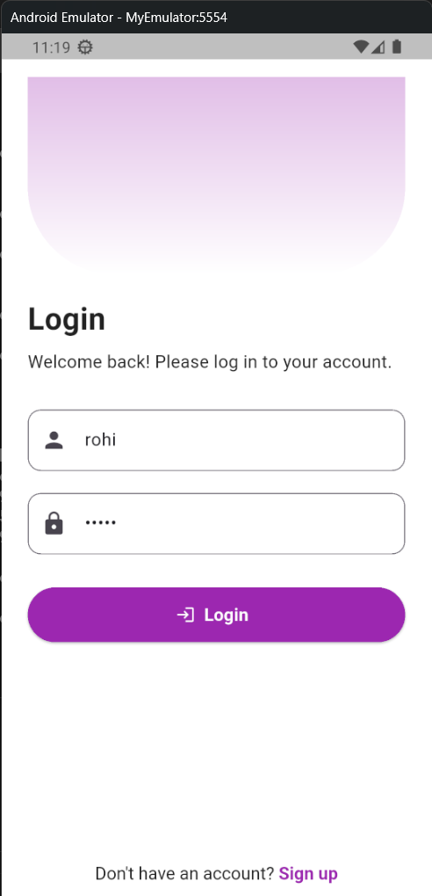
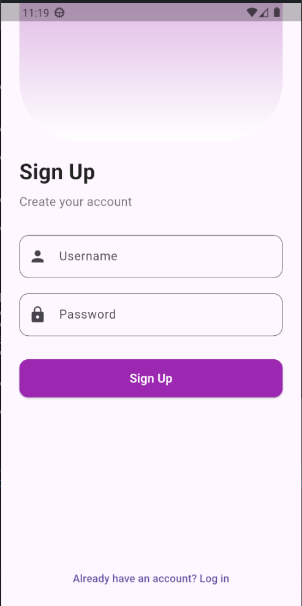
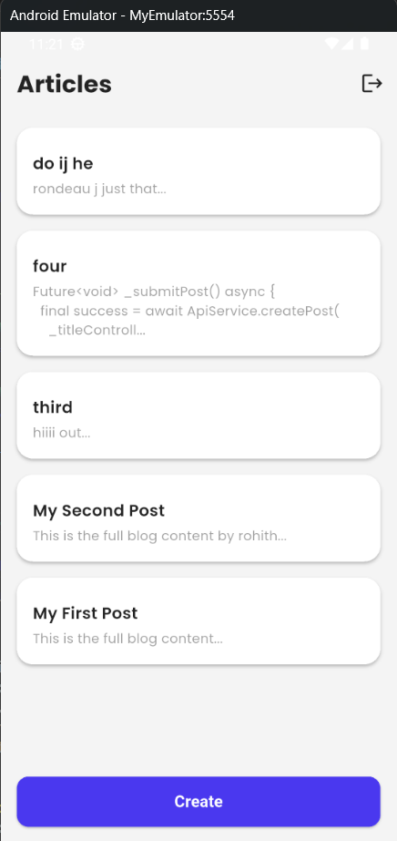
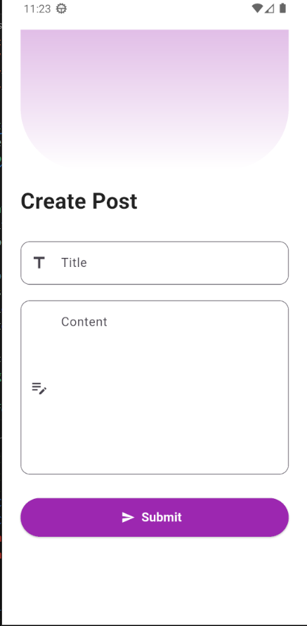
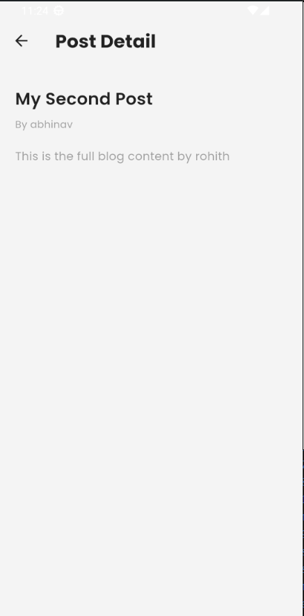

# 📱 Full-Stack Blog App (Django + Flutter)

This is a full-stack mobile application that allows users to sign up, log in, create, and view blog posts. The project consists of:

- 🐍 **Backend**: Django + Django REST Framework + JWT authentication
- 💙 **Frontend**: Flutter with a modern, responsive UI

---

##  Features

###  Authentication
- User sign up and login
- JWT-based secure authentication

###  Blog Features
- Create and view blog posts
- List view and detailed view for each post
- Post summary and full content
- Responsive UI

###  Tech Stack

| Layer        | Technology                   |
|--------------|------------------------------|
| Backend      | Django, DRF, JWT (SimpleJWT) |
| Frontend     | Flutter, Dart          c     |
| Communication| REST API (HTTP)              |


##  Project Structure

my-app-repo/
├── backend/ # Django backend project
├── frontend/ # Flutter mobile app


##  Getting Started

### Django Backend

```bash
cd backend
python -m venv env
source env/bin/activate  # or `env\Scripts\activate` on Windows
pip install -r requirements.txt
python manage.py runserver
Flutter Frontend
```

### Flutter Frontend
```bash
cd frontend
flutter pub get
flutter run
```


## 📱 Screenshots

### 🔐 Login Screen


### 📝 Sign Up Screen


### ➕ Home Screen


### ➕ Create Post Screen


### ➕ Home Screen



### Contributing
Feel free to fork this repo, open issues, or suggest features via pull requests.

### 📄 License
This project is licensed under the MIT License.


Let me know if you'd like this customized with:
- Blog
- Abhinav K G
- Screenshot support
- Deployment instructions (for Firebase, Render, Vercel, etc.)

I can also generate a `.gitignore`, `requirements.txt`, or GitHub Actions setup if needed.